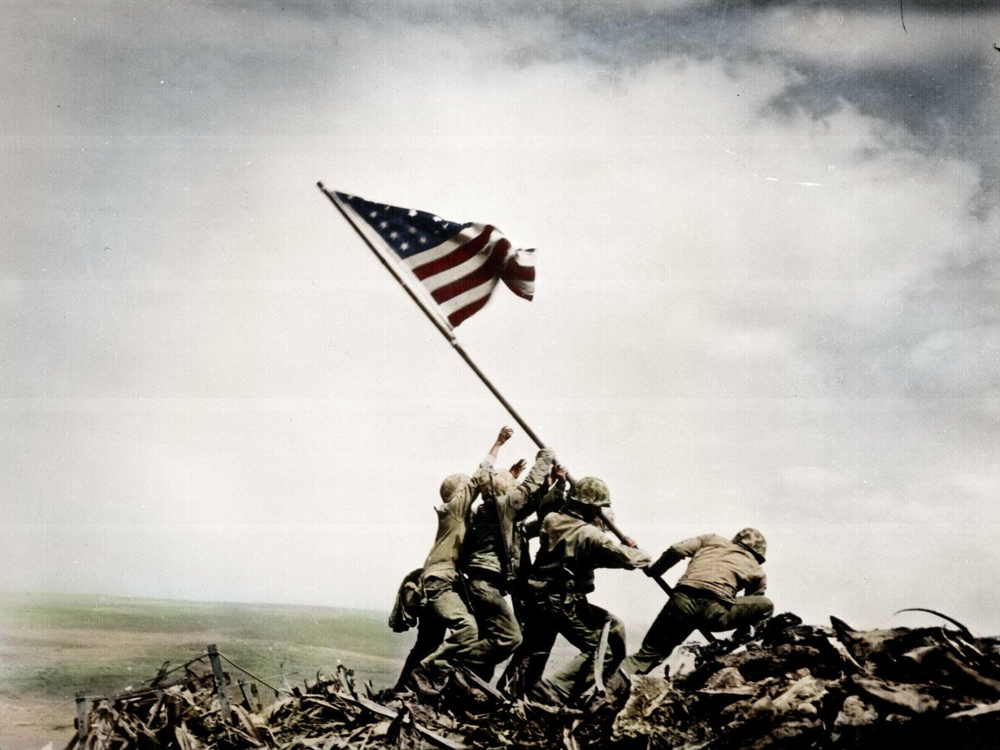

  

<h2 align="center">Hey! I'm Daffa Rabbani</h2>

###

# 💫 About Me:
🌱 I’m currently learning everything  💬 Ask me anything about Cloud Computing and Back-End Programming ⚡ Hobbyist programming, Jogging, Debugging, reading non-fiction books

###

 
<strong>What i am Learning / Working</strong>

    - 🌐 Web Developer (Bootstrap, Jquery, PHP, react)  
    - 📱 Mobile Developer (Flutter)  
    - 🌠 Enterprice Resource Planning (Idempiere, Odoo)   
    - 🖥️ DevOps(Jenkins, Docker)  
    - ☁ Cloud Engineer (AWS, GCP, Firebase, Supabase)  
    - 📊 System architecture 

###

## 🌐 Socials:
    

## 💻 Tech Stack:

